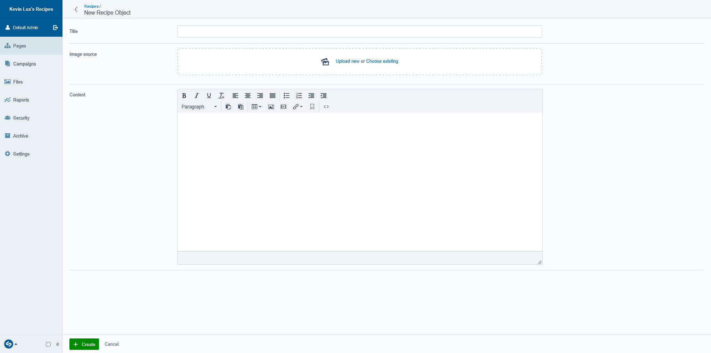

# Recipe Website using SilverStripe CMS


<br>

#### The project
I made a little website with SilverStripe. I haven't deployed it (hence the substitute demo gif) but I wanted
to share my experience here anyway. The idea for this project was to make a website to store all my recipes in a more
presentable and easily accessible way than something like Dropbox, which is what I currently use for my recipes. While
Dropbox has its perks, I really don't like how inconvenient it is for looking at recipes on your phone. Looking at
a text file on mobile (be it txt, pdf, or docx) just involves way too much pinching and squinting. Storing my recipes on
a responsive website is arguably superior in that regard.

#### But... where's all the stuff?
Admittedly, the website looks quite bare, but that is by design. Since the end user of this website in at least 95% of
cases is me
there is no need for a header or a footer, no need for an 'About' page and a 'Contact' page, and thus no need for a navigation
bar. Obviously not great for SEO, but again this is not something I am at all concerned with. My goal is not to create
a monetizable food blog. I'm just looking to replace my current solution for storing and accessing my recipes with
something a little more convenient.

#### Getting set up

I completed this project in Windows. Not usually my preference, but I already had XAMPP installed on my school-issued
Windows laptop from a prior project. Getting started with SilverStripe was pretty straightforward.
There were only a few things I needed to configure in XAMPP:

- add a new VirtualHost in httpd-vhosts.conf. In my case it looked like this:
```
<VirtualHost *:80>
    ServerAdmin youremail@email.com
    DocumentRoot "C:/xampp/htdocs/<project_name>/public"
    ServerName <project_name>.localhost
    ServerAlias <project_name>.localhost
    ErrorLog "logs/<project_name>-error.log"
    CustomLog "logs/<project_name>-access.log" common
</VirtualHost>
```
- edit the hosts file in C:\Windows\System32\drivers\etc to include
```
127.0.0.1 <project_name>.localhost
```
- and finally, enable the intl PHP extension by uncommenting it in the php.ini file

#### Creating the project

Time to create a SilverStripe project. In the htdocs directory of XAMPP, run (I used Git Bash for this):
```
composer create-project silverstripe/installer <project_name>
```

This will create a new directory in htdocs that will be the root of the project. However, the actual entry point
for the application is the index.php file in <project_name>/public directory, which is why we had to specify that
directory as the document root in the virtual hosts configuration.

Next up, create a .env file in the root directory of the project and add the following:

```SS_DATABASE_CLASS="MySQLDatabase"
SS_DATABASE_NAME="<whatever_you_wanna_call_it>"
SS_DATABASE_SERVER="localhost"
SS_DATABASE_USERNAME="root"
SS_DATABASE_PASSWORD=""
SS_DEFAULT_ADMIN_USERNAME="admin"
SS_DEFAULT_ADMIN_PASSWORD="password"
SS_ENVIRONMENT_TYPE="dev"
```
The final step before we can access the admin panel is to run a 'dev build' by opening your browser of choice
and going to <project_name>.localhost/dev/build. Now the admin panel is accessible via <project_name>.localhost/admin.
But since we haven't written any code yet there isn't anything super interesting to do there at this stage. So let's get
to it!

#### Time to write some code

Actually, before we start coding we've got to think about exactly what it is we're after. In my case I wanted the website to have:
- a home page that displays the title and image of all my recipes
- pages for every individual recipe that display title, image, and content (the actual recipe)

How do we make this happen with SilverStripe? Let's take this one step at a time. First we'll focus on creating recipes.
To do this we're going to create a new file called 'RecipeObject.php' in 'recipes/app/src/' (recipes is the name of
my project root). In that file we need to tell SilverStripe what exactly a recipe object is and how we can create one.
The following code achieves this (please note that for the sake of brevity I will not include imports in the code
snippets, but you can find them in the actual project):
```php
class RecipeObject extends DataObject {

  private static $db = [
    'Title' => 'Text',
    'Content' => 'HTMLText',
    'ImageURL' => 'Text'
  ];
  
// $has_one defines the relationship between RecipeObject and other pages/objects
// in this case: every RecipeObject has one ImageSource, and every RecipeObject has
// one RecipesPage. We haven't created a RecipesPage yet, but we'll get to that shortly
// (RecipesPage will be the home page that shows all the recipes, as outlined above).
  private static $has_one = [
    'ImageSource' => Image::class,
    'RecipesPage' => RecipesPage::class,
  ];

// here we specify that every RecipeObject owns an ImageSource.
// this is what allows us to render the image in our template
  private static $owns = [
    'ImageSource'
  ];

// this is where we define the CMS fields we want to see when creating a RecipeObject
// we're creating an UploadField for ImageSource. We're telling SilverStripe to store
// uploaded images in a directory called 'RecipeImages', and then we're making sure
// we allow image uploads in formats we don't want
// finally, we return a TextField for the recipe title, the imageField we just defined,
// and an HTMLEditorField that will hold the recipe content
  public function getCMSFields() {
    $imageField = UploadField::create('ImageSource');
    $imageField->setFolderName('RecipeImages');
    $imageField->getValidator()->setAllowedExtensions(['jpg', 'jpeg', 'png']);
    return FieldList::create(
      TextField::create('Title'),
      $imageField,
      HTMLEditorField::create('Content'),
    );
  }

}

```
All right! Now we've got our RecipeObject, but how do we actually create a recipe? We will do that from the page that
holds all the recipes. And to create that page we first have to create a new page type, called RecipesPage
(note: 'Recipe**s**' not 'Recipe'). So, in the
same directory as the RecipeObject class, create a new file called RecipesPage.php and add the following:

```php
class RecipesPage extends Page {

// As we saw in the code snippet above, every RecipeObject has one RecipesPage.
// Correspondingly, every RecipesPage has many RecipeObjects
  private static $has_many = [
    'RecipeObjects' => RecipeObject::class
  ];
  
  public function getCMSFields() {
// in terms of CMS fields we want those we get from the parent class ('Page')
    $fields = parent::getCMSFields();
// additionally we want to add a field that allows us to create a RecipeObject
    $fields->addFieldToTab('Root.Main', GridField::create('RecipeObjects',
      'Recipes',
      $this->RecipeObjects(),
      GridFieldConfig_RecordEditor::create()
    ));
      return $fields;
  }
}

```

So now we have our RecipeObject and we have a place in which we can add new recipes.
What comes next? As indicated at the start of this section,
we want to be able to show the title and image of each recipe on the home page, and to do
that we're going to create a new template for RecipesPage (we will later set our home page to be of type
RecipesPage. In 'recipes/themes/templates/Layout', create a file called 'RecipesPage.ss' and add the following:
```html
<div class="container">
  <div class="row">
    <% loop $RecipeObjects %>
    <div class="col-sm-3">
      <a href="$Link"></a>
      <h3 class="all-recipes-heading">
        <a href="$Link"><b>$Title</b></a>
      </h3>
    </div>
    <% end_loop %>
  </div>
</div>
```
Here we loop through all the recipes that have been created. For each recipe we will display its title and image.
Of course at this stage we have not added any recipes yet, so nothing would show (I'll go through the process of
adding recipes at the end). You can see in the code that both the title and the image of each recipe are also hyperlinks that
take you to '$Link'. $Link has to do with the last remaining problem we need to solve to complete the architecture of
our website.

When a user clicks on the title or image of a recipe, we want that link to take the user to a page that
displays that recipe in its entirety. You might be tempted (like I was) to think that to solve this problem we need to
create another page type. In some sense that seems intuitive, but what we're looking for here is not to manually create
a page for every single recipe in the same way we would create a page of type RecipesPage, or an About or Contact page.
Instead we want to find a way to programmatically generate individual recipe pages based on the RecipeObjects that we
already have. To achieve this we're going to use a page controller action.

Back in 'recipes/app/src', create a file called RecipesPageController.php and add the following code:

```php
class RecipesPageController extends PageController {

  private static $allowed_actions = [
    'show'
  ];

  public function show(HTTPRequest $request) {
    $recipe = RecipeObject::get()->byID($request->param('ID'));

    if (!$recipe) {
      return $this->httpError(404, 'No such recipe');
    }

    return [
      'Recipe' => $recipe
    ];
  }
}
```
Remember that RecipeObject extends DataObject, and one of the attributes 
RecipeObject inherits from its parent is a unique ID. This is an ID that is auto-incrementing and auto-assigned to each
RecipeObject upon creation. Your first recipe will have an ID of 1, the second one 2, etc. In the RecipesPageController,
we define a method called 'show' that lets us read a request parameter in the URL. This request parameter is what comes
after '/show/' in the URL. So if the URL is 'recipes.localhost/recipes/show/5', then the parameter is 5. We then use that
value to search through all RecipeObjects and find the one that has an ID of 5. If there is one, we return it, if there
isn't we show a Page Not Found.

Next up we need to add some code to 'RecipeObject.php' in order to enable RecipeObjects to produce a link to a page that
contains the full recipe. Add the following above the getCMSFields() method:

```php
  public function Link() {
    return $this->RecipesPage()->Link('show/'.$this->ID);
  }
```
Now we just need to create a template for this page, which because our method in the RecipesPageController
was called 'show' has to be named 'RecipesPage_show.ss':
```php
<div>
    <% with $Recipe %>
        <h2>$Title</h2>
        
        <p>$Content</p>
    <% end_with %>
</div>
```
Here we receive a recipe as '$Recipe', which is what we return in the 'show' method in the RecipesPageController. We can
then use that recipe in our template.

And we're done coding!

#### Time to create a recipe!

Now that we're done coding, we just have to set up a couple more things
in the admin panel. But before that, of course, we have to run another dev/build. So in your browser, once again go to
<project_name>.localhost/dev/build and wait for that to finish. Then, log into the admin panel again. From there,
go to 'Pages' and delete the 'Home', 'About', and 'Contact' pages. Then add a new page of type 'Recipes page' and
you should see something that looks like this:
<br>
<br>

<br>
<br>
Here it's important to set the URL segment to 'home' so that when users access '<project_name>.localhost', they will
see the Recipes page we're currently creating. If you scroll down you should be able to see a green button that says
'Add Recipe Object:
<br>
<br>

<br>
<br>
Click that button and you'll be taken to the recipe creation interface, which looks like this:
<br>
<br>

<br>
<br>
As soon as you create a recipe here, it will show up on the home page and will also get its own page.
Your website may well look a little different from mine, which will be the result of the style changes I've done.
But I won't go into those here.

#### Conclusion


#### Bonus
Here's a screenshot of the website on a bigger screen, in case you want to look at my pretty bakes all at once

